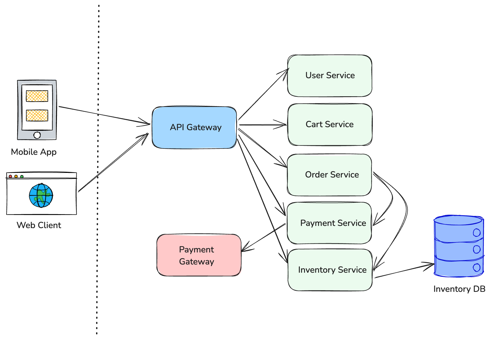

# Scenario: Log Analysis Challenge

## Overview

You are part of the engineering team at PrimoMart, an e-commerce platform built using a microservices architecture. The platform has been experiencing intermittent issues with customers reporting failed purchases, payments being processed but orders not being fulfilled, and general slowness during peak hours.

Your task is to analyze log data from various services to identify patterns, correlate events across services, and determine the root cause of these issues.

## Application Architecture



PrimoMart consists of the following key microservices:

1. **API Gateway**: Routes requests to appropriate services, handles API key validation
2. **User Service**: Manages user authentication, profiles, and sessions
3. **Catalog Service**: Provides product information, pricing, and availability
4. **Cart Service**: Manages shopping cart contents
5. **Order Service**: Processes order placement and tracking
6. **Payment Service**: Handles payment processing and verification
7. **Inventory Service**: Tracks product stock and reservations

## Timeline of Events

- **9:00 AM**: Daily traffic begins increasing as business hours start
- **10:30 AM**: First customer complaints about slow checkout process
- **11:15 AM**: Payment processing starts showing increased error rates
- **12:00 PM**: Major spike in traffic during lunch hour promotions
- **12:15 PM**: Order confirmation emails delayed
- **12:30 PM**: Multiple reports of payments being charged but orders showing "pending"
- **1:45 PM**: Issue reaches critical status as more customers report problems
- **2:30 PM**: Operations team begins investigation (your starting point)

## Log Data

Below are sample logs from various services during the period of interest. The logs are in JSON format with timestamps, service names, and relevant details.

### API Gateway Logs

```json
{"timestamp":"2023-08-15T10:15:03.231Z","level":"INFO","service":"api-gateway","trace_id":"a1b2c3d4e5f6","message":"Request received","method":"GET","path":"/api/products","response_time_ms":45,"status_code":200}
{"timestamp":"2023-08-15T10:28:14.112Z","level":"INFO","service":"api-gateway","trace_id":"f6e5d4c3b2a1","message":"Request received","method":"GET","path":"/api/user/profile","response_time_ms":62,"status_code":200}
{"timestamp":"2023-08-15T10:35:22.876Z","level":"WARN","service":"api-gateway","trace_id":"1a2b3c4d5e6f","message":"Slow response detected","method":"POST","path":"/api/cart/checkout","response_time_ms":2350,"status_code":200}
{"timestamp":"2023-08-15T11:02:17.654Z","level":"INFO","service":"api-gateway","trace_id":"6f5e4d3c2b1a","message":"Request received","method":"POST","path":"/api/payments/process","response_time_ms":876,"status_code":200}
{"timestamp":"2023-08-15T11:17:43.129Z","level":"ERROR","service":"api-gateway","trace_id":"2c3d4e5f6a7b","message":"Upstream service timeout","method":"POST","path":"/api/orders/create","response_time_ms":5000,"status_code":504,"upstream_service":"order-service"}
{"timestamp":"2023-08-15T11:45:19.872Z","level":"WARN","service":"api-gateway","trace_id":"7b6a5f4e3d2c","message":"Rate limit approaching for client","client_id":"mobile-app","requests_per_minute":178,"limit":200}
{"timestamp":"2023-08-15T12:03:02.514Z","level":"ERROR","service":"api-gateway","trace_id":"3d4e5f6a7b8c","message":"Upstream service error","method":"POST","path":"/api/inventory/reserve","response_time_ms":2134,"status_code":500,"upstream_service":"inventory-service"}
{"timestamp":"2023-08-15T12:15:33.777Z","level":"ERROR","service":"api-gateway","trace_id":"8c7b6a5f4e3d","message":"Multiple upstream services experiencing high latency","affected_services":["order-service","inventory-service","payment-service"]}
{"timestamp":"2023-08-15T12:32:55.188Z","level":"INFO","service":"api-gateway","trace_id":"4e5f6a7b8c9d","message":"Request received","method":"GET","path":"/api/orders/status/87654","response_time_ms":1243,"status_code":200}
{"timestamp":"2023-08-15T13:11:28.921Z","level":"ERROR","service":"api-gateway","trace_id":"9d8c7b6a5f4e","message":"Circuit breaker triggered for service","upstream_service":"inventory-service","error_rate":0.27,"threshold":0.25}
```

### Order Service Logs

```json
{"timestamp":"2023-08-15T10:30:12.543Z","level":"INFO","service":"order-service","trace_id":"1a2b3c4d5e6f","message":"Order checkout initiated","user_id":"user_12345","cart_id":"cart_7890","items_count":3}
{"timestamp":"2023-08-15T10:30:13.112Z","level":"INFO","service":"order-service","trace_id":"1a2b3c4d5e6f","message":"Payment processing started","order_id":"order_54321","amount":127.94,"currency":"USD"}
{"timestamp":"2023-08-15T10:30:14.332Z","level":"INFO","service":"order-service","trace_id":"1a2b3c4d5e6f","message":"Payment confirmed","order_id":"order_54321","payment_id":"pmt_6789"}
{"timestamp":"2023-08-15T10:30:14.894Z","level":"INFO","service":"order-service","trace_id":"1a2b3c4d5e6f","message":"Inventory reservation requested","order_id":"order_54321","items":[{"product_id":"prod_123","quantity":1},{"product_id":"prod_456","quantity":2}]}
{"timestamp":"2023-08-15T10:30:15.543Z","level":"INFO","service":"order-service","trace_id":"1a2b3c4d5e6f","message":"Inventory confirmed","order_id":"order_54321"}
{"timestamp":"2023-08-15T10:30:15.987Z","level":"INFO","service":"order-service","trace_id":"1a2b3c4d5e6f","message":"Order completed","order_id":"order_54321","status":"confirmed"}
{"timestamp":"2023-08-15T11:17:38.129Z","level":"INFO","service":"order-service","trace_id":"2c3d4e5f6a7b","message":"Order checkout initiated","user_id":"user_23456","cart_id":"cart_8901","items_count":5}
{"timestamp":"2023-08-15T11:17:38.723Z","level":"INFO","service":"order-service","trace_id":"2c3d4e5f6a7b","message":"Payment processing started","order_id":"order_65432","amount":312.50,"currency":"USD"}
{"timestamp":"2023-08-15T11:17:40.006Z","level":"INFO","service":"order-service","trace_id":"2c3d4e5f6a7b","message":"Payment confirmed","order_id":"order_65432","payment_id":"pmt_7890"}
{"timestamp":"2023-08-15T11:17:40.432Z","level":"INFO","service":"order-service","trace_id":"2c3d4e5f6a7b","message":"Inventory reservation requested","order_id":"order_65432","items":[{"product_id":"prod_789","quantity":3},{"product_id":"prod_012","quantity":2}]}
{"timestamp":"2023-08-15T11:17:43.129Z","level":"ERROR","service":"order-service","trace_id":"2c3d4e5f6a7b","message":"Inventory service timeout","order_id":"order_65432"}
{"timestamp":"2023-08-15T11:17:43.130Z","level":"WARN","service":"order-service","trace_id":"2c3d4e5f6a7b","message":"Order placed in pending status due to inventory issues","order_id":"order_65432","status":"pending"}
{"timestamp":"2023-08-15T12:01:23.456Z","level":"INFO","service":"order-service","trace_id":"3d4e5f6a7b8c","message":"Order checkout initiated","user_id":"user_34567","cart_id":"cart_9012","items_count":2}
{"timestamp":"2023-08-15T12:01:24.123Z","level":"INFO","service":"order-service","trace_id":"3d4e5f6a7b8c","message":"Payment processing started","order_id":"order_76543","amount":89.97,"currency":"USD"}
{"timestamp":"2023-08-15T12:01:25.678Z","level":"INFO","service":"order-service","trace_id":"3d4e5f6a7b8c","message":"Payment confirmed","order_id":"order_76543","payment_id":"pmt_8901"}
{"timestamp":"2023-08-15T12:01:26.321Z","level":"INFO","service":"order-service","trace_id":"3d4e5f6a7b8c","message":"Inventory reservation requested","order_id":"order_76543","items":[{"product_id":"prod_345","quantity":1},{"product_id":"prod_678","quantity":1}]}
{"timestamp":"2023-08-15T12:03:02.514Z","level":"ERROR","service":"order-service","trace_id":"3d4e5f6a7b8c","message":"Inventory service error","order_id":"order_76543","error":"Internal Server Error"}
{"timestamp":"2023-08-15T12:03:02.515Z","level":"WARN","service":"order-service","trace_id":"3d4e5f6a7b8c","message":"Order placed in pending status due to inventory issues","order_id":"order_76543","status":"pending"}
{"timestamp":"2023-08-15T12:15:05.678Z","level":"WARN","service":"order-service","message":"Database connection pool nearing capacity","current":85,"max":100,"latency_ms":250}
{"timestamp":"2023-08-15T12:30:12.345Z","level":"ERROR","service":"order-service","message":"Database query timeout","query":"UPDATE orders SET status = ? WHERE id = ?","timeout_ms":3000}
{"timestamp":"2023-08-15T12:45:56.789Z","level":"ERROR","service":"order-service","message":"Multiple database timeouts detected","timeouts_1min":12,"connection_pool_size":100,"connection_pool_used":98}
{"timestamp":"2023-08-15T13:05:43.210Z","level":"FATAL","service":"order-service","message":"Database connection failure","error":"Too many connections","host":"orders-db-primary"}
```

### Payment Service Logs

```json
{"timestamp":"2023-08-15T10:30:13.212Z","level":"INFO","service":"payment-service","trace_id":"1a2b3c4d5e6f","message":"Payment request received","order_id":"order_54321","amount":127.94,"payment_method":"credit_card"}
{"timestamp":"2023-08-15T10:30:13.876Z","level":"INFO","service":"payment-service","trace_id":"1a2b3c4d5e6f","message":"Payment processed successfully","order_id":"order_54321","payment_id":"pmt_6789","transaction_id":"tx_abcdef123456"}
{"timestamp":"2023-08-15T11:17:38.923Z","level":"INFO","service":"payment-service","trace_id":"2c3d4e5f6a7b","message":"Payment request received","order_id":"order_65432","amount":312.50,"payment_method":"credit_card"}
{"timestamp":"2023-08-15T11:17:39.876Z","level":"INFO","service":"payment-service","trace_id":"2c3d4e5f6a7b","message":"Payment processed successfully","order_id":"order_65432","payment_id":"pmt_7890","transaction_id":"tx_bcdefg234567"}
{"timestamp":"2023-08-15T11:45:12.345Z","level":"INFO","service":"payment-service","trace_id":"bcdefa123456","message":"Payment request received","order_id":"order_12345","amount":78.65,"payment_method":"credit_card"}
{"timestamp":"2023-08-15T11:45:14.543Z","level":"WARN","service":"payment-service","trace_id":"bcdefa123456","message":"Payment gateway slow response","gateway":"stripe","latency_ms":2198}
{"timestamp":"2023-08-15T11:45:14.987Z","level":"INFO","service":"payment-service","trace_id":"bcdefa123456","message":"Payment processed successfully","order_id":"order_12345","payment_id":"pmt_12345","transaction_id":"tx_cdefgh345678"}
{"timestamp":"2023-08-15T12:01:24.456Z","level":"INFO","service":"payment-service","trace_id":"3d4e5f6a7b8c","message":"Payment request received","order_id":"order_76543","amount":89.97,"payment_method":"paypal"}
{"timestamp":"2023-08-15T12:01:25.234Z","level":"INFO","service":"payment-service","trace_id":"3d4e5f6a7b8c","message":"Payment processed successfully","order_id":"order_76543","payment_id":"pmt_8901","transaction_id":"tx_defghi456789"}
{"timestamp":"2023-08-15T12:15:34.567Z","level":"WARN","service":"payment-service","message":"Increased payment gateway errors observed","gateway":"stripe","error_rate":"3.8%","threshold":"2%"}
{"timestamp":"2023-08-15T12:30:45.678Z","level":"ERROR","service":"payment-service","trace_id":"efghi5678901","message":"Payment gateway timeout","gateway":"stripe","order_id":"order_23456","timeout_ms":10000}
{"timestamp":"2023-08-15T12:30:55.789Z","level":"INFO","service":"payment-service","trace_id":"efghi5678901","message":"Payment retry successful","order_id":"order_23456","payment_id":"pmt_23456","transaction_id":"tx_fghijk567890","attempt":2}
{"timestamp":"2023-08-15T12:45:12.345Z","level":"ERROR","service":"payment-service","message":"Multiple payment gateway timeouts","gateway":"stripe","timeouts_5min":15,"success_rate":"82%"}
{"timestamp":"2023-08-15T13:00:23.456Z","level":"INFO","service":"payment-service","message":"Switching to backup payment gateway","primary":"stripe","backup":"adyen","reason":"high_error_rate"}
```

### Inventory Service Logs

```json
{"timestamp":"2023-08-15T10:30:14.987Z","level":"INFO","service":"inventory-service","trace_id":"1a2b3c4d5e6f","message":"Inventory reservation request","order_id":"order_54321","items":[{"product_id":"prod_123","quantity":1},{"product_id":"prod_456","quantity":2}]}
{"timestamp":"2023-08-15T10:30:15.321Z","level":"INFO","service":"inventory-service","trace_id":"1a2b3c4d5e6f","message":"Stock availability confirmed","order_id":"order_54321","all_items_available":true}
{"timestamp":"2023-08-15T10:30:15.432Z","level":"INFO","service":"inventory-service","trace_id":"1a2b3c4d5e6f","message":"Inventory reserved successfully","order_id":"order_54321","reservation_id":"rsv_12345"}
{"timestamp":"2023-08-15T11:17:40.654Z","level":"INFO","service":"inventory-service","trace_id":"2c3d4e5f6a7b","message":"Inventory reservation request","order_id":"order_65432","items":[{"product_id":"prod_789","quantity":3},{"product_id":"prod_012","quantity":2}]}
{"timestamp":"2023-08-15T11:17:41.123Z","level":"INFO","service":"inventory-service","trace_id":"2c3d4e5f6a7b","message":"Stock availability confirmed","order_id":"order_65432","all_items_available":true}
{"timestamp":"2023-08-15T11:17:41.321Z","level":"INFO","service":"inventory-service","trace_id":"2c3d4e5f6a7b","message":"Database query started","query_type":"update","tables":["inventory","reservations"]}
{"timestamp":"2023-08-15T11:30:23.456Z","level":"WARN","service":"inventory-service","message":"Slow database query detected","query_type":"update","duration_ms":1500,"threshold_ms":1000}
{"timestamp":"2023-08-15T11:45:34.567Z","level":"WARN","service":"inventory-service","message":"Database connection pool usage high","usage_percent":75,"threshold_percent":70}
{"timestamp":"2023-08-15T12:01:26.987Z","level":"INFO","service":"inventory-service","trace_id":"3d4e5f6a7b8c","message":"Inventory reservation request","order_id":"order_76543","items":[{"product_id":"prod_345","quantity":1},{"product_id":"prod_678","quantity":1}]}
{"timestamp":"2023-08-15T12:01:28.123Z","level":"INFO","service":"inventory-service","trace_id":"3d4e5f6a7b8c","message":"Stock availability confirmed","order_id":"order_76543","all_items_available":true}
{"timestamp":"2023-08-15T12:01:28.325Z","level":"INFO","service":"inventory-service","trace_id":"3d4e5f6a7b8c","message":"Database query started","query_type":"update","tables":["inventory","reservations"]}
{"timestamp":"2023-08-15T12:01:58.325Z","level":"ERROR","service":"inventory-service","trace_id":"3d4e5f6a7b8c","message":"Database query timeout","query_type":"update","duration_ms":30000,"threshold_ms":5000}
{"timestamp":"2023-08-15T12:02:00.123Z","level":"ERROR","service":"inventory-service","trace_id":"3d4e5f6a7b8c","message":"Failed to reserve inventory","order_id":"order_76543","error":"Database timeout"}
{"timestamp":"2023-08-15T12:15:12.345Z","level":"ERROR","service":"inventory-service","message":"Database connection errors increasing","error_rate":12,"connections_active":45,"connections_max":50}
{"timestamp":"2023-08-15T12:20:23.456Z","level":"WARN","service":"inventory-service","message":"Read replicas lag increasing","primary_db":"inventory-db-primary","lag_seconds":25,"threshold_seconds":10}
{"timestamp":"2023-08-15T12:30:34.567Z","level":"ERROR","service":"inventory-service","message":"Database query errors above threshold","error_rate":"15%","threshold":"5%","query_type":"update"}
{"timestamp":"2023-08-15T12:45:45.678Z","level":"ERROR","service":"inventory-service","message":"Multiple database timeouts detected","timeouts_5min":23}
{"timestamp":"2023-08-15T13:00:56.789Z","level":"FATAL","service":"inventory-service","message":"Database connection pool exhausted","active_connections":50,"max_connections":50,"wait_queue":25}
```

### Database Monitoring Logs

```json
{"timestamp":"2023-08-15T11:00:00.123Z","level":"INFO","service":"db-monitor","source":"inventory-db-primary","message":"System stats","cpu_percent":45,"memory_percent":60,"disk_io_util":30,"connections":40}
{"timestamp":"2023-08-15T11:30:00.456Z","level":"INFO","service":"db-monitor","source":"inventory-db-primary","message":"System stats","cpu_percent":55,"memory_percent":65,"disk_io_util":45,"connections":75}
{"timestamp":"2023-08-15T12:00:00.789Z","level":"WARN","service":"db-monitor","source":"inventory-db-primary","message":"System stats","cpu_percent":80,"memory_percent":70,"disk_io_util":65,"connections":120}
{"timestamp":"2023-08-15T12:15:00.012Z","level":"WARN","service":"db-monitor","source":"inventory-db-primary","message":"Slow queries increasing","slow_queries_1min":12,"threshold":5}
{"timestamp":"2023-08-15T12:30:00.345Z","level":"ERROR","service":"db-monitor","source":"inventory-db-primary","message":"System stats","cpu_percent":95,"memory_percent":85,"disk_io_util":90,"connections":180}
{"timestamp":"2023-08-15T12:45:00.678Z","level":"ERROR","service":"db-monitor","source":"inventory-db-primary","message":"Connection count critical","connections":230,"max_connections":250,"message":"Approaching connection limit"}
{"timestamp":"2023-08-15T13:00:00.901Z","level":"FATAL","service":"db-monitor","source":"inventory-db-primary","message":"System stats","cpu_percent":98,"memory_percent":92,"disk_io_util":95,"connections":248}
{"timestamp":"2023-08-15T13:00:10.234Z","level":"FATAL","service":"db-monitor","source":"inventory-db-primary","message":"Database server not responding to health checks","consecutive_failures":3}
```

## Workshop Tasks

### Task 1: Initial Log Analysis

Review the logs and identify:

1. Which services are experiencing issues?
2. At what time did the problems begin to appear?
3. What symptoms are visible in the logs?

### Task 2: Correlation Across Services

1. Using the trace IDs, track several complete transactions across different services
2. Note any patterns in failures or errors
3. Create a timeline of how issues cascade from one service to another

### Task 3: Root Cause Analysis

1. Based on your analysis, identify the most likely root cause of the issues
2. Explain how this root cause led to the symptoms observed by customers
3. Provide evidence from the logs to support your conclusion

### Task 4: Metrics and Alerting Recommendations

1. What metrics would have helped identify this issue earlier?
2. Design 3-5 alerts that could have provided early warning
3. Suggest improvements to the logging to make troubleshooting easier

## Discussion Questions

1. How did distributed tracing help in your analysis?
2. What challenges did you face in correlating events across services?
3. How might you implement better observability to prevent similar issues?
4. What role could automated anomaly detection play in this scenario?


